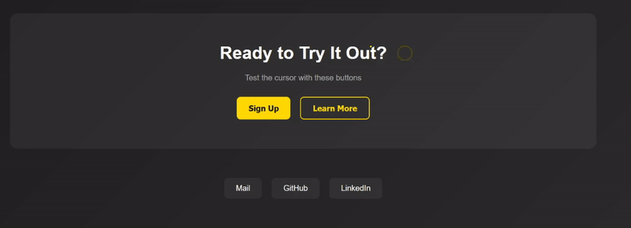

# React Adaptive Circledot-Cursor 🎯

A sleek, responsive, and customizable cursor component for React applications. This library provides an animated cursor that adapts to different interactive elements, creating an engaging user experience.



## ✨ Features

- 🎨 Smooth cursor animations
- 🔄 Adapts to different element shapes
- 🎯 Interactive hover effects
- 📱 Responsive design
- ⚡ Lightweight and performant
- 🛠️ Easy to customize

## 🚀 Installation

```bash
npm install circledot-cursor
# or
yarn add circledot-cursor
```

## 📖 Usage

1. Import the component:

```jsx
import CustomCursor from "circledot-cursor";
```

2. Add it to your app:

```jsx
function App() {
  return (
    <>
      <CustomCursor />
      {/* Your app content */}
    </>
  );
}
```

3. Add the class `social-button` to any circular elements you want the cursor to adapt to:

```jsx
<button className="social-button">Click me!</button>
```

## 🎨 Customization

You can customize the cursor by overriding the CSS variables:

```css
:root {
  --cursor-dot-size: 5px;
  --cursor-dot-color: yellow;
  --cursor-circle-size: 30px;
  --cursor-circle-border: 2px solid rgb(90, 90, 1);
}
```

## 📝 Props

| Prop        | Type   | Default          | Description                |
| ----------- | ------ | ---------------- | -------------------------- |
| dotSize     | number | 5                | Size of the cursor dot     |
| circleSize  | number | 30               | Size of the cursor circle  |
| dotColor    | string | 'yellow'         | Color of the cursor dot    |
| borderColor | string | 'rgb(90, 90, 1)' | Color of the circle border |

## 🌟 Examples

### Basic Usage

```jsx
import CustomCursor from "react-adaptive-cursor";

function App() {
  return (
    <div>
      <CustomCursor />
      <button>Normal Button</button>
      <a href="#" className="social-button">
        Social Link
      </a>
    </div>
  );
}
```

### Custom Styling

```jsx
<CustomCursor
  dotSize={8}
  circleSize={40}
  dotColor="#ff0000"
  borderColor="#000000"
/>
```

## 🛠️ Development

1. Clone the repository

```bash
git clone https://github.com/yourusername/circledot-cursor.git
```

2. Install dependencies

```bash
npm install
```

3. Start development

```bash
npm run dev
```

## 📄 License

MIT © [Tejas Gaikwad]

## 🤝 Contributing

1. Fork it
2. Create your feature branch (`git checkout -b feature/amazing-feature`)
3. Commit your changes (`git commit -m 'Add amazing feature'`)
4. Push to the branch (`git push origin feature/amazing-feature`)
5. Open a Pull Request

## 🙌 Support

Give a ⭐️ if this project helped you!

## 📞 Contact

- GitHub: [@tejas](https://github.com/yourusername)
